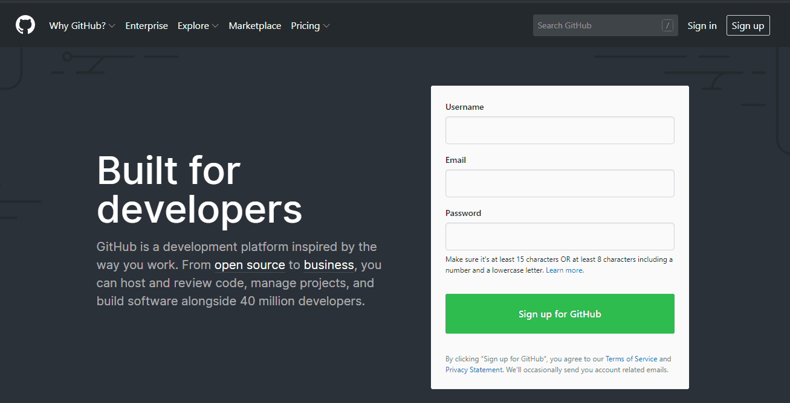
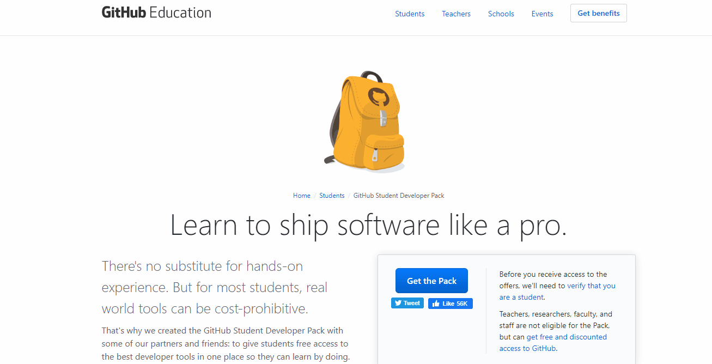
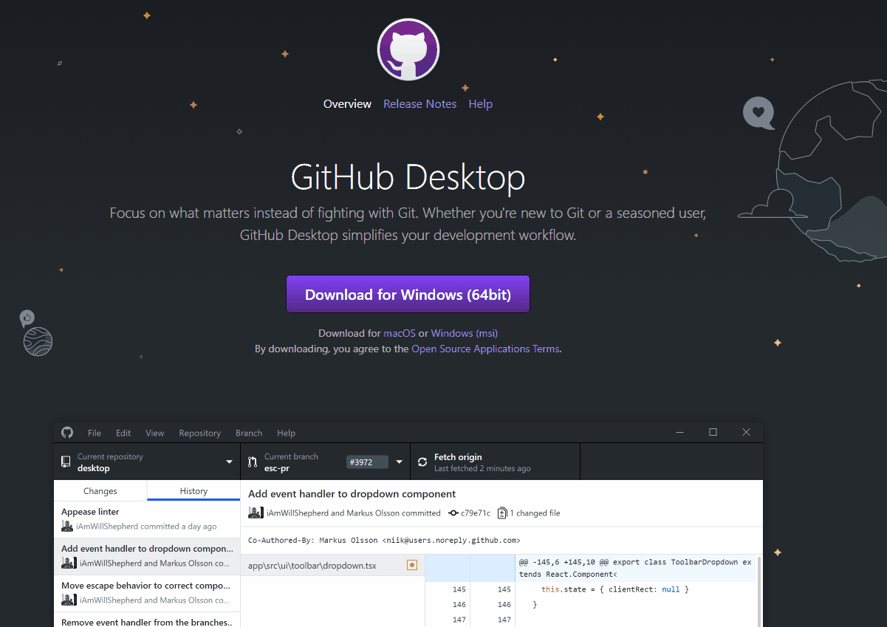

# Github...Git what??

## What is this GitHub you speak of?

GitHub is a online version control system that is built upon [https://git-scm.com/](git).

It will appear a bit scary to start with but with use we'll achieve ninja level skills.

Basically think of it as a service that you can use to save your work and allow you to track all your changes...and also recover from any *problems* with your work!

This page explains it quite well: [Introduction to Git](https://guides.github.com/introduction/git-handbook/).

---

## Cool..so how do we use it

### Do you have a github account already?
First thing is that you'll have to have a GitHub account already created. If you already have...ace...you get to skip this part and go to *Using GitHub* below.

* Open a browser and go to [https://github.com/](github.com) and sign up for an account.
  To start with its **strongly** recommended you use your college email...don't worry you can change that later!

  

* Once you have an account and you would like some free stuff, then visit: [GitHub Education Students page](https://education.github.com/pack).
 It will also give you a free developer level account whilst you are in full time education...be aware though you will have to verify your a student at the college.

 

 You should now have an account and be good to go!

### Using GitHub

GitHub can be used in a variety of ways...either via the command line, the browser or a desktop app. To start with complete the following GitHub [Hello World](https://guides.github.com/activities/hello-world/) tutorial. ***Don't be tempted to skip this as you will be stuck later :)***

Once completed you should a *hello-world* repository in your account. This is good but it could be better by having the files directly on our computer so that we can work on them locally. This is known as **cloning**.

Have a read through this [Cloning](https://help.github.com/en/github/creating-cloning-and-archiving-repositories/cloning-a-repository) guide for a general introduction.

However...due to network restrictions on the college network we will not be able to use the command line to clone repositories although your welcome to do so on your own computer on a non-college network.

This leaves us with either doing it all via the browser or using a desktop based Git application. Let's explore the desktop option from a college point of view...

* First, start GitHub Desktop.
  *If it is not already installed then you can get it from [here](https://desktop.github.com/)*
  

* Once installed/running have a look at the [Desktop Introduction](https://help.github.com/en/desktop/getting-started-with-github-desktop/creating-your-first-repository-using-github-desktop#step-2-create-a-new-repository)

---

If you've made it this far then you will now have a solid foundation in how to use Git and GitHub...just in time for it to be used for storing your college work :)

An example of good practice for this would be to create ***private*** repositories for any project work and *commit* your files for storage.

Get into the habit of this and your work will become easier and also remember to try to commit small and often. This means that it's usually better to have lot's of small commits solving lots of little problems then one massive commit containing lot's of solved problems...it makes it easier to manage your project if you need to resolve an issue later.

 
